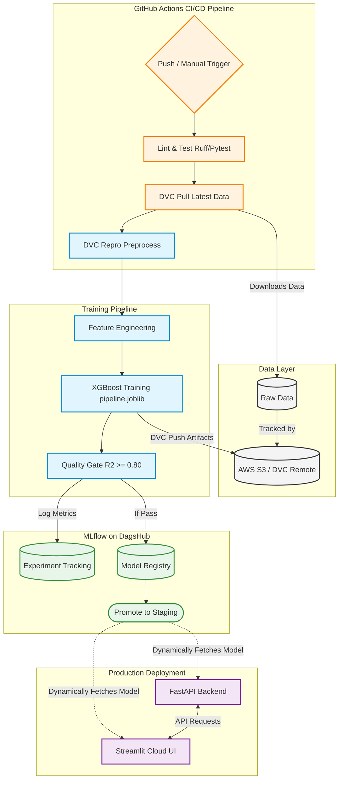

# ✈️ End-to-End MLOps Flight Price Predictor

[](https://www.python.org/)
[](https://mlflow.org/)
[](https://dvc.org/)
[](https://streamlit.io/)
[](https://github.com/ahmedsh711/mlops-flight-predictor/actions)

A complete, production-ready Machine Learning Operations (MLOps) pipeline for predicting domestic flight prices in India. This project demonstrates advanced data science feature engineering coupled with enterprise-grade MLOps automation, continuous training, and dynamic model serving.

## 🌟 Key Features

*   **Robust ML Pipeline:** Custom `ColumnTransformer` (OneHotEncoding, StandardScaler) unified with an `XGBoost` regressor to prevent training-serving skew.
*   **Target Transformation:** Wraps the model in a `TransformedTargetRegressor` (using `log1p`) to handle heavily right-skewed flight prices, drastically improving $R^2$.
*   **Spatial & Temporal Engineering:** Hand-crafted Haversine distance calculations and advanced temporal extractions from raw timestamps.
*   **Data & Model Versioning (DVC):** Tracks raw data, processed data, and serialized models (`.joblib`, `.onnx`) using DVC backed by AWS S3.
*   **Experiment Tracking (MLflow):** Integrates with DagsHub MLflow to automatically log hyperparameters, metrics, and models.
*   **Continuous Training (CT):** A fully automated GitHub Actions workflow that pulls data, repros the DVC pipeline, trains the model, exports it to ONNX, and pushes the new lockfile back to Git.
*   **Dynamic Model Registry:** CI/CD automatically promotes models to the `Staging` stage if they pass the $R^2 \ge 0.80$ quality gate.
*   **Lightning Fast Deployment:** Uses `uv` for 17-second dependency resolution on Streamlit Cloud, dynamically fetching the latest model from the MLflow registry on boot.

## 🏗️ System Architecture



## 📂 Repository Structure

```text
.
├── .github/workflows/       # CI/CD and Continuous Training Actions
├── data/
│   ├── raw/                 # Raw CSV files (tracked by DVC)
│   └── processed/           # Engineered features (tracked by DVC)
├── experiments/             # MLflow training scripts
├── models/                  # Serialized pipelines (joblib/ONNX)
├── src/flight_predictor/    # Core ML logic (features, train, evaluate)
├── api/                     # FastAPI backend
├── streamlit_app.py         # Streamlit UI
├── dvc.yaml                 # DVC pipeline definition
├── pyproject.toml           # Project metadata
└── uv.lock                  # Deterministic lockfile
```

## 🚀 Getting Started

### Prerequisites
*   Python 3.11+
*   [`uv`](https://github.com/astral-sh/uv) (Extremely fast Python package installer)
*   A DagsHub account (for MLflow remote tracking)

### 1. Installation
Clone the repository and install dependencies using `uv`:
```bash
git clone https://github.com/ahmedsh711/mlops-flight-predictor.git
cd mlops-flight-predictor
uv sync
source .venv/bin/activate
```

### 2. Pull Data and Models
The data and models are versioned with DVC. To download the latest versions from AWS S3:
```bash
dvc pull
```

### 3. Environment Variables
Create a `.env` file in the root directory for MLflow authentication:
```env
MLFLOW_TRACKING_URI="https://dagshub.com/ahmedsh711/mlops-flight-predictor.mlflow"
MLFLOW_TRACKING_USERNAME="your_dagshub_username"
MLFLOW_TRACKING_PASSWORD="your_dagshub_password_or_token"
```

### 4. Run the Streamlit Application
Start the interactive UI locally:
```bash
streamlit run streamlit_app.py
```
*Note: The app will automatically connect to DagsHub, download the latest `Staging` model version, and cache it in RAM for instant inference.*

### 5. Run the Training Pipeline
To retrain the model locally and track the experiment in MLflow:
```bash
dvc repro process
python experiments/train_with_mlflow.py
```

## 🛠️ Continuous Training (CI/CD)

This project features a fully automated Continuous Training (CT) loop. When triggered via GitHub Actions:
1. The runner installs dependencies and pulls raw data.
2. The ML pipeline is executed.
3. The model is evaluated. If $R^2 \ge 0.80$, it is registered to MLflow.
4. The model is exported to ONNX format.
5. New model artifacts are committed via DVC and pushed to AWS S3.
6. The updated `dvc.lock` is automatically committed and pushed back to the `main` branch.
7. The model is transitioned to `Staging`, where the Streamlit app seamlessly picks it up.
