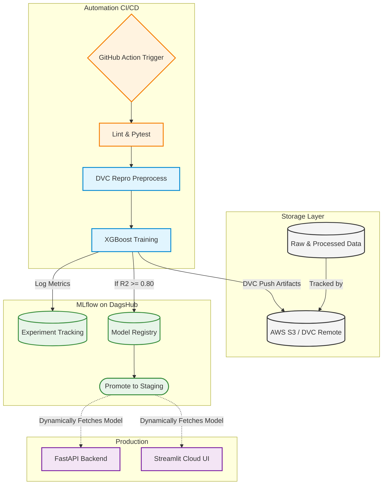

# ✈️ Flight Price Predictor — An End-to-End MLOps Journey

[](https://www.python.org/)
[](https://mlflow.org/)
[](https://dvc.org/)
[](https://streamlit.io/)
[](https://github.com/ahmedsh711/mlops-flight-predictor/actions)

Welcome to the **Flight Price Predictor**! This repository isn't just a machine learning model—it's a fully automated, production-ready MLOps system built from scratch. 

Predicting flight prices is notoriously difficult because they are highly volatile and heavily right-skewed. The goal of this project was to move beyond just building a predictive model in a Jupyter Notebook and instead engineer a complete lifecycle: from data versioning and continuous training to dynamic serving in the cloud.

---

## 📖 Table of Contents
- [The Problem We're Solving](#-the-problem-were-solving)
- [System Architecture](#-system-architecture)
- [Engineering Challenges & Solutions](#-engineering-challenges--solutions)
- [Repository Structure](#-repository-structure)
- [Getting Started (Run it Locally)](#-getting-started)

---

## 🎯 The Problem We're Solving
Flight tickets fluctuate wildly based on time, route, and season. Most tutorials stop at training an algorithm. This project implements a real-world **Continuous Training (CT)** pipeline. 
If the data changes, the system automatically pulls it, retrains the model, exports it, and pushes it to production without human intervention. 

### Core Tech Stack:
- **ML Framework:** Scikit-Learn, XGBoost
- **MLOps:** DVC (Data Versioning), MLflow (Experiment Tracking), DagsHub
- **CI/CD:** GitHub Actions
- **Serving & UI:** FastAPI, Streamlit, `uv` (Package Manager)

---

## 🏗️ System Architecture

To ensure the model is scalable and reliable, the infrastructure is heavily decoupled:



---

## 💡 Engineering Challenges & Solutions

Building an end-to-end pipeline comes with edge cases. Here’s how the hardest parts were solved:

1. **Handling the "Long Tail" of Flight Prices:**
   * **Challenge:** Airline prices are severely right-skewed (a few last-minute business class tickets can ruin the model's error metrics).
   * **Solution:** Wrapped the `XGBoost` model inside a `TransformedTargetRegressor` to train on `log1p` prices and predict back to `expm1`. This drastically stabilized the predictions, achieving an $R^2$ of **0.84**.

2. **Preventing Training-Serving Skew:**
   * **Challenge:** If you preprocess data differently in production than in training, the model fails silently.
   * **Solution:** Encapsulated the `ColumnTransformer` (OneHotEncoding, StandardScaler) directly into a unified Scikit-Learn `Pipeline`. The raw input hits the pipeline, and the prediction comes out. 

3. **Ultra-Fast Cloud Boot Times:**
   * **Challenge:** Streamlit Cloud can be painfully slow to boot up standard `pip` environments.
   * **Solution:** Migrated the dependency resolver to `uv`, dropping the cold-boot environment setup to just **17 seconds** for 112 packages.

4. **Dynamic Model Serving:**
   * **Challenge:** Hardcoding model binaries into the repository causes Git bloat and requires full redeployments for every new model.
   * **Solution:** The UI completely decouples the model. On boot, it authenticates with the MLflow API on DagsHub, searches for the latest model with the `Staging` alias, and caches it in RAM. 

---

## 📂 Repository Structure

```text
.
├── .github/workflows/       # CI/CD and Continuous Training runners
├── data/                    # Empty locally; hydrated via `dvc pull`
├── experiments/             # MLflow training scripts
├── models/                  # Serialized pipelines (joblib/ONNX)
├── src/flight_predictor/    # Core ML logic (features, train, evaluate)
├── api/                     # FastAPI backend
├── streamlit_app.py         # Streamlit UI
├── dvc.yaml                 # DVC pipeline DAG
└── uv.lock                  # Deterministic dependency lockfile
```

---

## 🚀 Getting Started

If you want to run this pipeline on your own machine, follow these steps:

### Prerequisites
*   Python 3.11+
*   [`uv`](https://github.com/astral-sh/uv) installed
*   A [DagsHub](https://dagshub.com/) account for remote tracking

### 1. Installation
Clone the repo and sync the environment:
```bash
git clone https://github.com/ahmedsh711/mlops-flight-predictor.git
cd mlops-flight-predictor
uv sync
source .venv/bin/activate
```

### 2. Pull the Data (AWS S3)
Because data and models are versioned using DVC, you won't see them in Git. Pull them down:
```bash
dvc pull
```

### 3. Setup Credentials
Create a `.env` file in the root directory:
```env
MLFLOW_TRACKING_URI="https://dagshub.com/ahmedsh711/mlops-flight-predictor.mlflow"
MLFLOW_TRACKING_USERNAME="your_username"
MLFLOW_TRACKING_PASSWORD="your_token"
```

### 4. Fire up the App!
Run the Streamlit application locally:
```bash
streamlit run streamlit_app.py
```
*(The app will dynamically fetch the model from DagsHub and boot up!)*

---
*Built with ❤️ to explore the realities of production MLOps.*
