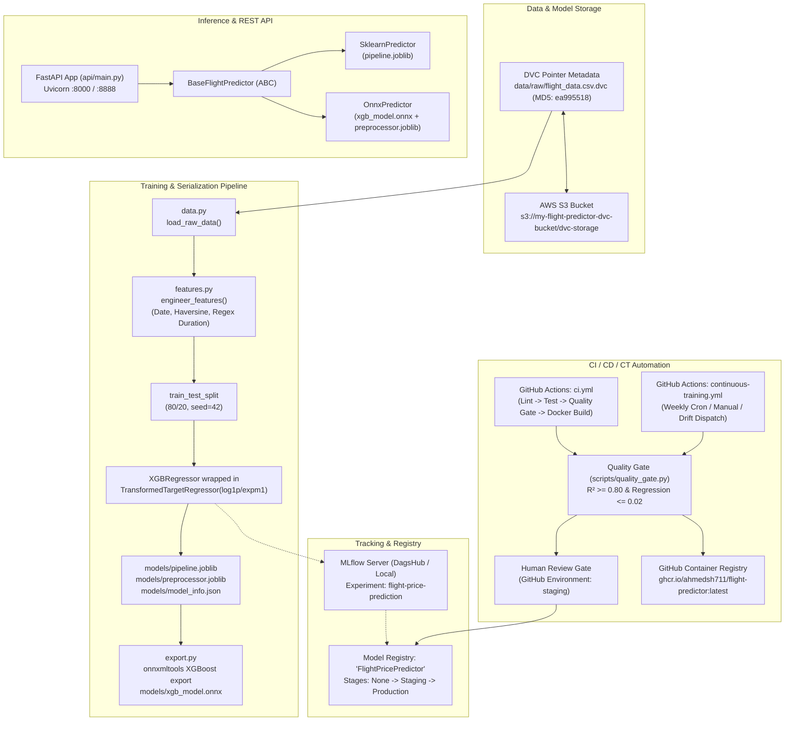

# Flight Price Predictor — Comprehensive System Documentation & Engineering Log

**Author:** Ahmed Al-Shobaki  
**Project:** Indian Domestic Flight Price Prediction (MLOps Level 2)  
**Target:** Predict airfare in Indian Rupees (INR) with $R^2 \ge 0.80$ and regression tolerance $\le 0.02$.  
**Repository:** [ahmedsh711/mlops-flight-predictor](https://github.com/ahmedsh711/mlops-flight-predictor)  
**Remote Storage:** AWS S3 (`s3://my-flight-predictor-dvc-bucket/dvc-storage`)  
**Experiment Tracking:** DagsHub Hosted MLflow + Local SQLite MLflow  
**Container Registry:** GitHub Container Registry (`ghcr.io/ahmedsh711/flight-predictor:latest`)

---

## Table of Contents
1. [Executive Overview & Problem Statement](#1-executive-overview--problem-statement)
2. [End-to-End System Architecture](#2-end-to-end-system-architecture)
3. [The 5 Critical Legacy Bugs & Root Cause Analyses](#3-the-5-critical-legacy-bugs--root-cause-analyses)
4. [Tooling, Frameworks & Infrastructure Stack](#4-tooling-frameworks--infrastructure-stack)
5. [Real-World Engineering Challenges & Debugging Journey](#5-real-world-engineering-challenges--debugging-journey)
6. [Codebase Anatomy & Module Walkthrough](#6-codebase-anatomy--module-walkthrough)
7. [Continuous Integration & Continuous Training (CI/CT)](#7-continuous-integration--continuous-training-cict)
8. [Quality Gates, Model Registry & Safety Thresholds](#8-quality-gates-model-registry--safety-thresholds)
9. [Operational Runbook & Developer Commands](#9-operational-runbook--developer-commands)

---

## 1. Executive Overview & Problem Statement

### 1.1 The Business Problem
Indian domestic airline ticket prices fluctuate heavily based on booking advance windows, flight duration, number of layovers, departure/arrival times, seasonal monsoon impacts, and airport connectivity. The business objective was to produce a reliable, low-latency, production-ready machine learning service capable of predicting flight fares in Indian Rupees (INR) for major travel routes across 7 core Indian metropolitan hubs:
* **BLR:** Bengaluru (Kempegowda)
* **DEL:** Delhi (Indira Gandhi)
* **BOM:** Mumbai (Chhatrapati Shivaji)
* **MAA:** Chennai
* **CCU:** Kolkata (Netaji Subhas)
* **COK:** Cochin
* **HYD:** Hyderabad (Rajiv Gandhi)

### 1.2 Evolution from Notebook to MLOps Level 2
* **Initial State (Legacy Notebook `extract.py`):**
  * Monolithic, unversioned script with hardcoded Windows filesystem paths.
  * Live external network calls during training loops (causing timeouts and non-determinism).
  * Naive duration parsing that crashed on short flights (e.g. 5m / 45m).
  * Mathematical regression flaw where target transformations were stripped upon serialization, causing the model to predict log-prices ($\approx 8.6$) instead of real rupee values ($\approx ₹5,500$).
  * Unversioned data, unpinned random seeds, baseline $R^2 = 0.7598$.
* **Current State (MLOps Level 2 Production Platform):**
  * Fully packaged, editable Python library managed via Astral `uv` and `pyproject.toml`.
  * Modular separation of concerns (`config`, `data`, `features`, `train`, `export`, `predict`, `api`).
  * Dual inference engine: Scikit-Learn Pipeline and ONNX Runtime.
  * Deterministic data versioning via DVC with AWS S3 remote backend.
  * Centralized experiment tracking and model registry via MLflow (DagsHub remote + local).
  * High-performance FastAPI microservice with correlation ID tracking, Pydantic v2 schemas, and health endpoints.
  * Multi-stage Docker packaging published to GitHub Container Registry.
  * Robust GitHub Actions CI/CD and Continuous Training (CT) with an automated quality gate and human-in-the-loop Staging promotion approval.
  * Measured production performance: **$R^2 = 0.8449$**, **$\text{RMSE} = ₹1,812$**, **$\text{MAE} = ₹1,144$**, **73.63% test coverage (38 passing tests)**.

---

## 2. End-to-End System Architecture



---

## 3. The 5 Critical Legacy Bugs & Root Cause Analyses

### Bug #1: Hardcoded Windows Filesystem Paths
* **Problem:** In `extract.py`, paths were hardcoded as raw Windows strings (e.g. `pd.read_csv(r"C:\00-Shobaki\...")`).
* **Root Cause:** Presumed local desktop filesystem structure.
* **Failure Mode:** Immediate `FileNotFoundError` on any developer environment other than the original PC, failing unconditionally on Linux runners and Docker containers.
* **Resolution:** Implemented dynamic root directory resolution in `src/flight_predictor/config.py`:
  ```python
  if os.getenv("PROJECT_ROOT"):
      ROOT_DIR = Path(os.environ["PROJECT_ROOT"]).resolve()
  elif (Path.cwd() / "pyproject.toml").exists() or (Path.cwd() / "data").exists():
      ROOT_DIR = Path.cwd().resolve()
  else:
      ROOT_DIR = Path(__file__).parent.parent.parent.resolve()
  ```
  All application paths (`DATA_RAW_DIR`, `MODELS_DIR`) derive dynamically from `ROOT_DIR`.

### Bug #2: Live Geopy API Calls in Training Loop
* **Problem:** The original script instantiated `Nominatim().geocode(city)` inside the feature extraction pipeline.
* **Root Cause:** Online geocoding API utilized for static physical geographic landmarks.
* **Failure Modes:**
  1. `IndentationError` from typo in `geocode( city)`.
  2. `GeocoderTimedOut` / HTTP 429 when OpenStreetMap rate-limited requests during iteration.
  3. Non-deterministic training results if coordinates changed or the network fluctuated.
* **Resolution:** Created an immutable dictionary `AIRPORT_COORDS` in `config.py` with known coordinates for all seven project airports:
  ```python
  AIRPORT_COORDS = {
      "BLR": (12.9716, 77.5946),
      "DEL": (28.7041, 77.1025),
      "BOM": (19.0760, 72.8777),
      "MAA": (13.0827, 80.2707),
      "CCU": (22.5726, 88.3639),
      "COK": (9.9312, 76.2673),
      "HYD": (17.3850, 78.4867),
  }
  ```
  Combined with the Haversine formula in `features.py`, route distance computation is $O(1)$ in-memory, fully offline, and 100% deterministic.

### Bug #3: Duration Parser String-Splitting Crash
* **Problem:** `duration.split("h")[1]` was used to extract duration components.
* **Root Cause:** Assumed every duration string contained an `"h"` (hours) token.
* **Failure Mode:** `IndexError: list index out of range` on short flights containing only minutes. In the training dataset, row 6474 (`Air India`, Mumbai $\rightarrow$ Hyderabad, `"5m"`) crashed the entire preprocessing job.
* **Resolution:** Replaced naive splitting with dual regular expressions in `features.py`:
  ```python
  def parse_duration_to_minutes(duration: str) -> int:
      s = str(duration).strip()
      if s.isdigit():
          return int(s)
      hours_match = re.search(r"(\d+)h", s)
      mins_match = re.search(r"(\d+)m", s)
      h = int(hours_match.group(1)) if hours_match else 0
      m = int(mins_match.group(1)) if mins_match else 0
      return h * 60 + m
  ```
  Safely parses `"2h 45m"`, `"3h"`, `"45m"`, `"5m"`, and raw integers.

### Bug #4: Missing `TransformedTargetRegressor` in Saved Model Artifact
* **Problem:** Cross-validation utilized `TransformedTargetRegressor` with `log1p`/`expm1`, but the final model was serialized via `joblib.dump(xgb_model)`.
* **Root Cause:** Separation of cross-validation evaluation code from final model persistence code.
* **Failure Mode:** The saved artifact produced predictions in natural logarithm space ($\approx 8.6$ for a ₹5,500 flight), an error of three orders of magnitude.
* **Resolution:** Built a single, encapsulated Scikit-Learn `Pipeline` where `TransformedTargetRegressor` wraps the `XGBRegressor`:
  ```python
  ttr_model = TransformedTargetRegressor(
      regressor=XGBRegressor(**xgb_params),
      func=np.log1p,
      inverse_func=np.expm1
  )
  pipeline = Pipeline([
      ("preprocessor", preprocessor),
      ("model", ttr_model)
  ])
  ```
  Saving `pipeline.joblib` ensures preprocessing, gradient boosting trees, and inverse target transformation are executed atomically.

### Bug #5: Miscellaneous Reproducibility & Categorical Failures
* **Problem:** Lack of random seeds, crashes on rare airline categories, and missing data validation.
* **Root Cause:** Ad-hoc exploratory scripting without defensive engineering.
* **Resolution:**
  * Injected `random_state=42` across `train_test_split`, `XGBRegressor`, and cross-validation folds.
  * Mapped rare airlines ("Jet Airways Business", "Trujet") to `"Other"` prior to one-hot encoding (`handle_unknown="ignore"` configured in `OneHotEncoder`).
  * Enforced validation in `data.py`: shape checks ($\ge 100$ rows), required column presence, and outlier price bounds ($₹500 \le \text{Price} \le ₹100,000$).

---

## 4. Tooling, Frameworks & Infrastructure Stack

| Layer | Technology | Version | Purpose |
|---|---|---|---|
| **Language** | Python | `3.11.9` | Core runtime |
| **Package Management** | Astral `uv` | `0.12+` | Blazing-fast dependency resolution and venv management |
| **Data Manipulation** | Pandas, NumPy | `^2.2.0`, `^1.26.0` | In-memory feature manipulation and array math |
| **Machine Learning** | XGBoost, Scikit-Learn | `^2.0.0`, `^1.4.0` | Gradient boosted tree ensembles and pipeline composition |
| **Inference Acceleration** | ONNX Runtime, ONNXMLTools | `^1.18.0`, `^1.16.0` | Open Neural Network Exchange graph serialization and execution |
| **Web API Framework** | FastAPI, Uvicorn | `^0.141.0`, `^0.29.0` | Async REST API, OpenAPI documentation, and ASGI server |
| **Data Validation** | Pydantic v2 | `^2.7.0` | Schema parsing, strict type checking, and route validation |
| **Data Versioning** | DVC, DVC-S3 | `^3.50.0`, `^3.1.0` | Large-file content hashing and remote synchronization to AWS S3 |
| **Cloud Storage** | AWS S3 | `us-east-1` | Remote DVC storage (`my-flight-predictor-dvc-bucket`) |
| **Experiment Tracking** | MLflow | `^2.12.0` | Metric/parameter logging, artifact tracking, Model Registry |
| **Hosted MLOps** | DagsHub | Remote Hub | Managed MLflow server and repository synchronization |
| **Containerization** | Docker, Docker Compose | Multi-stage | Reproducible runtime images and service orchestration |
| **Code Quality** | Ruff | `^0.4.0` | Fast Rust-based linter and formatter |
| **Testing** | Pytest, Pytest-Cov | `^8.0.0`, `^5.0.0` | Unit/integration testing and coverage enforcement |
| **CI/CD / CT** | GitHub Actions | Workflows v4/v5 | Automated linting, testing, quality gates, and scheduled retraining |
| **Container Registry** | GitHub Container Registry (GHCR) | OCI Compliant | Cloud deployment target for production Docker images |

---

## 5. Real-World Engineering Challenges & Debugging Journey

### Challenge 1: The `pygtrie 2.6.0` Incompatibility in DVC
* **Symptom:** VS Code DVC extension logs and background polling flooded with:
  ```text
  AttributeError: type object 'Trie' has no attribute '_NONE_STEP'
  ```
  Triggered when running `python -m dvc data status --granular --unchanged --json`.
* **Root Cause Analysis:**
  * DVC's internal data layer (`dvc-data`) depends on `sqltrie` (v0.11.2).
  * `sqltrie/pygtrie.py` directly references an internal class attribute: `pygtrie.Trie._NONE_STEP`.
  * The upstream `pygtrie` package released version `2.6.0`, which refactored or removed `_NONE_STEP`.
* **Solution:**
  1. Downgraded `pygtrie` in `.venv` to `2.5.0`.
  2. Pinned `"pygtrie<2.6.0"` under `[project.optional-dependencies].experiments` in `pyproject.toml` so future installations never pull the broken release.
  3. Verified that `dvc data status` returned exit code 0 and clean JSON output.

### Challenge 2: Dual-Scale Tolerances in ONNX Parity
* **Symptom:** `AssertionError: ONNX parity check failed! Max diff = 0.139648 > 0.0001`.
* **Root Cause Analysis:**
  * The model outputs predictions in log-space ($\ln(\text{price} + 1)$).
  * In log-space, Scikit-Learn float64 and ONNX float32 differ by only $1.24 \times 10^{-5}$ ($\le 10^{-4}$).
  * When `np.expm1()` is applied, ticket prices in the $₹5,000$ to $₹20,000$ range amplify that rounding error by $\approx 10,000\times$, resulting in an absolute difference of $\approx 0.14$ INR (14 paise).
  * Calling `verify_onnx_parity(atol=1e-4)` failed because it evaluated INR space instead of log space.
* **Solution:**
  Refactored `verify_onnx_parity()` in `src/flight_predictor/export.py` to support dual-space evaluation:
  * If `atol <= 1e-3`: compares raw tree predictions in **log-space** (where ONNX executes natively).
  * If `atol > 1e-3` (default `0.5` INR): compares final rupee predictions in **INR-space**.
  Both verification modes now pass deterministically.

### Challenge 3: YAML 1.1 Norway / Boolean Trap in GitHub Actions
* **Symptom:** Python test verifying workflow syntax reported:
  ```text
  Valid YAML. Triggers: []
  ✗ Trigger: schedule
  ✗ Trigger: workflow_dispatch
  ```
* **Root Cause Analysis:**
  * Under the YAML 1.1 specification used by PyYAML, unquoted `on:` is parsed as boolean `True`.
  * The resulting Python dictionary was `{'name': '...', True: {'schedule': ...}}`, meaning `doc.get('on')` returned `None`.
* **Solution:**
  Quoted `"on":` in [.github/workflows/ci.yml](file:///home/shobaki/projects/flight-price-prediction/MLOps/mlops-flight-predictor/.github/workflows/ci.yml) and [.github/workflows/continuous-training.yml](file:///home/shobaki/projects/flight-price-prediction/MLOps/mlops-flight-predictor/.github/workflows/continuous-training.yml). This complies with GitHub Actions recommendations and PyYAML parsing.

### Challenge 4: Remote MLflow Authentication on Cloud Runners
* **Symptom:** Retraining on GitHub Actions runners failed with HTTP 401 Unauthorized when connecting to DagsHub.
* **Root Cause Analysis:**
  * Locally, credentials can be set interactively. On GitHub Actions, runners are ephemeral cloud VMs.
  * MLflow relies on `MLFLOW_TRACKING_USERNAME` and `MLFLOW_TRACKING_PASSWORD` environment variables to inject Basic Authentication headers.
* **Solution:**
  1. Configured repository secrets via GitHub CLI: `MLFLOW_TRACKING_URI`, `MLFLOW_TRACKING_USERNAME`, `MLFLOW_TRACKING_PASSWORD`.
  2. Updated `continuous-training.yml` to inject credentials across both workflow-level and step-level environments.

### Challenge 5: Coordinating Continuous Training with Human Approval Gate
* **Symptom:** `experiments/train_with_mlflow.py` was originally written as a standalone script that auto-promoted models to `Staging` inside Python, bypassing Job 2 (`approve-staging`) in the CI/CD pipeline.
* **Solution:**
  * Updated `train_with_mlflow.py` to inspect `os.getenv("CI")`.
  * When running inside GitHub Actions (`CI=true`), the script saves model artifacts and logs the model to the registry with stage `"None"`.
  * It defers promotion so Job 2 (GitHub Environment human approval gate) and Job 3 (`promote-staging`) execute the stage transition only after human sign-off.

---

## 6. Codebase Anatomy & Module Walkthrough

```text
mlops-flight-predictor/
├── .dvc/                             # DVC configuration and local/remote pointers
│   └── config                        # S3 remote configuration (us-east-1)
├── .github/
│   └── workflows/
│       ├── ci.yml                    # Pull request & push CI pipeline
│       └── continuous-training.yml   # Scheduled & drift-triggered CT pipeline
├── api/                              # FastAPI REST microservice
│   ├── __init__.py
│   ├── main.py                       # App factory, lifespan, routes (/health, /predict)
│   └── schemas.py                    # Pydantic v2 request/response models and Enums
├── data/                             # Data directory (tracked by DVC, ignored by git)
│   ├── raw/flight_data.csv.dvc       # DVC tracking pointer (MD5: ea995518...)
│   └── processed/                    # Feature-engineered parquet cache
├── docs/
│   └── PROJECT_DOCUMENTATION.md      # Comprehensive technical documentation
├── experiments/
│   └── train_with_mlflow.py          # Multi-configuration MLflow experiment sweep
├── models/                           # Model artifact directory (ignored by git)
│   ├── pipeline.joblib               # Full Scikit-Learn pipeline (preprocessor + TTR)
│   ├── preprocessor.joblib           # Standalone ColumnTransformer for ONNX inference
│   ├── xgb_model.onnx                # Serialized ONNX computation graph
│   ├── model_info.json               # Training metrics, params, and feature counts
│   └── previous_best_r2.txt          # Quality gate benchmark record (0.8449)
├── reports/
│   ├── module-1.md                   # Module 1 submission report
│   └── module-2.md                   # Module 2 submission report
├── scripts/
│   └── quality_gate.py               # Quality gate enforcement script (CLI argparse)
├── src/
│   └── flight_predictor/             # Core Python package
│       ├── __init__.py
│       ├── config.py                 # Dynamic paths, coordinates, constants
│       ├── data.py                   # Data ingestion and defensive validation
│       ├── export.py                 # ONNX conversion and dual-scale parity verification
│       ├── features.py               # Pure feature extraction (dates, Haversine, regex)
│       ├── logging_conf.py           # Structured JSON logging and correlation IDs
│       ├── predict.py                # Abstract Base Class and Predictor implementations
│       └── train.py                  # Single-run training pipeline and CLI entrypoint
├── tests/
│   ├── __init__.py
│   ├── conftest.py                   # Pytest fixtures and mock predictors
│   ├── test_api.py                   # Endpoint integration and predictor tests
│   ├── test_features.py              # Pure function unit tests (regex, coords, stops)
│   └── test_serialization.py        # ONNX parity and latency benchmark tests
├── Dockerfile                        # Multi-stage production container build
├── docker-compose.yml                # API + local MLflow service orchestration
├── dvc.yaml                          # DVC reproducible pipeline stages (process->train->export)
├── dvc.lock                          # DVC content hash lockfile
└── pyproject.toml                    # Build system, package dependencies, tool configs
```

---

## 7. Continuous Integration & Continuous Training (CI/CT)

### 7.1 CI Workflow (`.github/workflows/ci.yml`)
Runs on every push to `main`, `develop`, and on pull requests:
1. **Job 1: Lint & Type Check:** Runs `ruff check` and `ruff format --check`. Fails fast on any stylistic, linting, or formatting flaw.
2. **Job 2: Unit & Integration Tests:** Spins up runner, installs package with `.[dev]`, runs `pytest` verifying that test coverage meets or exceeds requirements.
3. **Job 3: Quality Gate (Main branch only):** Pulls training data from AWS S3 via DVC credentials, runs `flight-train`, and executes `scripts/quality_gate.py`.
4. **Job 4: Docker Packaging:** Downloads validated model artifacts, logs in to GitHub Container Registry, builds the multi-stage Docker image, and tags/pushes `ghcr.io/ahmedsh711/flight-predictor:latest`.

### 7.2 CT Workflow (`.github/workflows/continuous-training.yml`)
Dedicated automated retraining pipeline triggered by:
* **Schedule:** Every Monday at 02:00 UTC (07:30 IST) via cron `0 2 * * 1`.
* **Manual Dispatch:** UI button in GitHub Actions with custom audit reason.
* **Repository Dispatch:** Webhook listener for `drift-detected` events from monitoring tools.

**Pipeline Structure:**
1. **Job 1 (`retrain`):**
   * Pulls raw data from AWS S3 via DVC.
   * Retrains model suite via `experiments/train_with_mlflow.py` and logs runs to DagsHub MLflow.
   * Validates quality gate ($R^2 \ge 0.80$, regression $\le 0.02$).
   * Pushes updated model weights to AWS S3 via `dvc push` and commits `.dvc` tracking files back to Git.
   * Exports outputs (`r2_score`, `run_id`, `triggered_by`).
2. **Job 2 (`approve-staging`):**
   * Targets GitHub Environment `staging`.
   * **Pauses execution** and requires explicit human review and approval by `ahmedsh711`.
3. **Job 3 (`promote-staging`):**
   * Executes only after human approval.
   * Connects to MLflow Model Registry via `MlflowClient` and transitions the approved model version from stage `"None"` to `"Staging"`.
   * Posts summary to GitHub Actions execution summary.

---

## 8. Quality Gates, Model Registry & Safety Thresholds

### 8.1 Quality Gate Criteria (`scripts/quality_gate.py`)
To prevent regressive, degenerate, or corrupted models from reaching production, any training run must satisfy two automated checks:

$$\text{Criteria 1: Absolute Performance Floor} \implies R^2 \ge 0.80$$

$$\text{Criteria 2: Regression Tolerance} \implies (R^2_{\text{previous}} - R^2_{\text{new}}) \le 0.02$$

If either condition fails, the quality gate raises `SystemExit(1)`, halting the CI/CD pipeline and aborting artifact deployment.

### 8.2 MLflow Model Registry Lifecycle
Models transition through strict lifecycle stages:
* **`None`:** Candidate model produced by training run. Awaiting evaluation and approval.
* **`Staging`:** Candidate passed quality gate and received human approval in GitHub Actions. Deployed to staging environment for integration testing and load verification.
* **`Production`:** Verified model actively serving live customer predictions in FastAPI.
* **`Archived`:** Superseded historical versions preserved for auditing and instantaneous rollback.

---

## 9. Operational Runbook & Developer Commands

### 9.1 Environment Setup
```bash
# 1. Clone repository
git clone https://github.com/ahmedsh711/mlops-flight-predictor.git
cd mlops-flight-predictor

# 2. Create virtual environment with Python 3.11
uv venv .venv --python 3.11
source .venv/bin/activate

# 3. Install in editable mode with development & experiment tools
uv pip install -e ".[dev,experiments]"
```

### 9.2 Data & Model Synchronization (DVC)
```bash
# Pull training data from AWS S3
export AWS_ACCESS_KEY_ID="your-access-key"
export AWS_SECRET_ACCESS_KEY="your-secret-key"
export AWS_DEFAULT_REGION="us-east-1"
dvc pull

# Check status of data and model tracked artifacts
dvc status
```

### 9.3 Training & Export
```bash
# Run standard pipeline (train -> evaluate -> save artifacts)
flight-train

# Run quality gate verification
python scripts/quality_gate.py

# Export inner XGBoost model to ONNX and verify parity
flight-export

# Run multi-config hyperparameter sweep with MLflow tracking
python experiments/train_with_mlflow.py
```

### 9.4 Testing & Code Quality
```bash
# Run linter and formatter checks
ruff check src/ api/ tests/ experiments/ scripts/
ruff format --check src/ api/ tests/ experiments/ scripts/

# Run complete test suite with coverage enforcement
pytest tests/ -v --cov=flight_predictor --cov-report=term-missing --cov-fail-under=70
```

### 9.5 Serving the API Locally
```bash
# Start FastAPI development server
uvicorn api.main:app --host 0.0.0.0 --port 8000 --reload

# Health check
curl -s http://localhost:8000/health | python -m json.tool

# Model metadata check
curl -s http://localhost:8000/model-info | python -m json.tool

# Single prediction
curl -s -X POST http://localhost:8000/predict \
  -H "Content-Type: application/json" \
  -d '{
    "airline": "IndiGo",
    "date_of_journey": "15/06/2024",
    "source": "Delhi",
    "destination": "Bangalore",
    "dep_time": "06:00",
    "arrival_time": "08:45",
    "duration": "2h 45m",
    "total_stops": "non-stop",
    "additional_info": "No info"
  }' | python -m json.tool
```

### 9.6 Docker & Compose Deployment
```bash
# Build multi-stage production image
docker build --target production -t flight-predictor:latest .

# Run container mounting local models read-only
docker run -p 8000:8000 -v $(pwd)/models:/app/models:ro flight-predictor:latest

# Or launch API + local MLflow tracking server together
docker compose up -d
```
